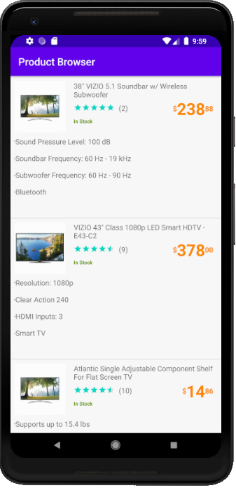
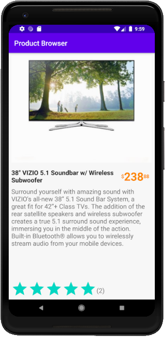

# Product Browser

This a List-Detail Android application for displaying a list of products in a list with some compact information. Further details about the product could be viewed by clicking on the products and get a detailed perspective of the specified product

## Getting Started

Clone the project on your local machine. Sync, build and run on your favorite Android emulator or device. 

### Prerequisites

No prerequisites required

## Screen shots

## Tests

The api calls are fully tested and mocked out using Mockito. A couple of extension functions were also tested for more unit test coverage. If I had the time I would dig further into various test scenarios and unit tests. 

## Built With

* [AndroidX](https://developer.android.com/jetpack/androidx/) - The Android framework used
* [Retrofit](https://square.github.io/retrofit/) - Used to make http calls and map responses
* [Dagger2](https://github.com/google/dagger) - Used for dependency injection
* [Glide](https://github.com/bumptech/glide/) - Used to load image assets into image viewers
* [Mockito](https://site.mockito.org/) - Used to Mock data for testing
* [RxJava](https://github.com/ReactiveX/RxJava/) - Used for making Asynchronous tasks
* [Coroutines](https://kotlinlang.org/docs/reference/coroutines-overview.html/) - Was not used in the project but was included for later upgrades from RxJava

## Authors

* **Amr Gharseldin** - *Development and design* -

## Acknowledgments

* Hat tip to [Busy Coder's Guide](https://commonsware.com/Android/) for the amazing resources they have.